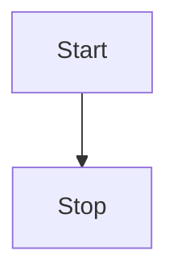

## 1. md-editor-v3-component

[md-editor-v3-component](https://github.com/renqiankun/md-editor-v3-component)是基于优秀的开源markdown编辑器[md-editor-v3](https://github.com/imzbf/md-editor-v3)基础上结合插件[markdown-it-vue-component](https://github.com/renqiankun/markdown-it-vue-component-demo)增加渲染自定义组件功能。

### 1.1 基本演示

#### 1.1.1 加载自定义组件

**1.1.1.1、my-card** <my-card tag='a' isBlock > { "type": "Hello" } </my-card>

**1.1.1.2、echarts组件** <my-chart> [ {"name":"Line 1","type":"line","data":[220,302,181,234,210,290,150]}, {"name":"Line 2","type":"line","data":[120,202,281,271,230,220,130]} ] </my-chart>

**1.1.1.3、element-plus table组件** <my-table> [ {"date":"2025-10-01","name":"小刀","address":"天津"}, {"date":"2025-10-02","name":"小刀2","address":"合肥"} ] </my-table>

**1.1.1.4、重写img，img替换为Element-plus组件** 

#### 1.1.2其他常规

**加粗**，<u>下划线</u>，_斜体_，~删除线~，上标<sup>26</sup>，下标<sub>[1]</sub>，`inline code`，[超链接](https://github.com/renqiankun)

1. 打开冰箱
2. 钻进去
3. 关闭冰箱

- 打开冰箱
- 钻出来
- 关闭冰箱

- [x] 打开冰箱
- [ ] 关闭冰箱

> 引用：这是一段文本引用


## 2. 代码演示

```js
import { defineComponent, ref } from 'vue';
import MdEditor from 'md-editor-v3';
import 'md-editor-v3/lib/style.css';

export default defineComponent({
  name: 'MdEditor',
  setup() {
    const text = ref('');
    return () => (
      <MdEditor modelValue={text.value} onChange={(v: string) => (text.value = v)} />
    );
  }
});
```

```shell [install:yarn]
yarn add md-editor-v3
```

```shell [install:npm]
npm i md-editor-v3
```

## 3. 文本演示

依照普朗克长度这项单位，目前可观测的宇宙的直径估计值（直径约 930 亿光年，即 8.8 × 10<sup>26</sup> 米）即为 5.4 × 10<sup>61</sup>倍普朗克长度。而可观测宇宙体积则为 8.4 × 10<sup>184</sup>立方普朗克长度（普朗克体积）。

## 4. 表格演示

| 昵称 | 猿龄（年） | 来自      |
| ---- | ---------- | --------- |
| 之间 | ∞          | 中国-重庆 |

## 5. 数学公式

$$
\begin{equation}
a^2+b^2=c^2
\end{equation}
$$

## 6. 图形



```echarts
{
  xAxis: {
    type: 'category',
    data: ['Mon', 'Tue', 'Wed', 'Thu', 'Fri', 'Sat', 'Sun']
  },
  yAxis: {
    type: 'value'
  },
  series: [
    {
      data: [150, 230, 224, 218, 135, 147, 260],
      type: 'line'
    }
  ]
}
```

## 7. 占个坑@！

!!! note

note, abstract, info, tip, success, question, warning, failure, danger, bug, example, quote, hint, caution, error, attention

!!!

!!! note note

note, abstract, info, tip, success, question, warning, failure, danger, bug, example, quote, hint, caution, error, attention

!!!

!!! tip tip

note, abstract, info, tip, success, question, warning, failure, danger, bug, example, quote, hint, caution, error, attention

!!!

!!! info info

note, abstract, info, tip, success, question, warning, failure, danger, bug, example, quote, hint, caution, error, attention

!!!

!!! quote quote

note, abstract, info, tip, success, question, warning, failure, danger, bug, example, quote, hint, caution, error, attention

!!!

!!! abstract abstract

note, abstract, info, tip, success, question, warning, failure, danger, bug, example, quote, hint, caution, error, attention

!!!

!!! attention attention

note, abstract, info, tip, success, question, warning, failure, danger, bug, example, quote, hint, caution, error, attention

!!!

!!! example example

note, abstract, info, tip, success, question, warning, failure, danger, bug, example, quote, hint, caution, error, attention

!!!

!!! hint hint

note, abstract, info, tip, success, question, warning, failure, danger, bug, example, quote, hint, caution, error, attention

!!!

!!! success success

note, abstract, info, tip, success, question, warning, failure, danger, bug, example, quote, hint, caution, error, attention

!!!

!!! question question

note, abstract, info, tip, success, question, warning, failure, danger, bug, example, quote, hint, caution, error, attention

!!!

!!! caution caution

note, abstract, info, tip, success, question, warning, failure, danger, bug, example, quote, hint, caution, error, attention

!!!

!!! warning warning

note, abstract, info, tip, success, question, warning, failure, danger, bug, example, quote, hint, caution, error, attention

!!!

!!! danger danger

note, abstract, info, tip, success, question, warning, failure, danger, bug, example, quote, hint, caution, error, attention

!!!

!!! failure failure

note, abstract, info, tip, success, question, warning, failure, danger, bug, example, quote, hint, caution, error, attention

!!!

!!! bug bug

note, abstract, info, tip, success, question, warning, failure, danger, bug, example, quote, hint, caution, error, attention

!!!

!!! error error

note, abstract, info, tip, success, question, warning, failure, danger, bug, example, quote, hint, caution, error, attention

!!!
